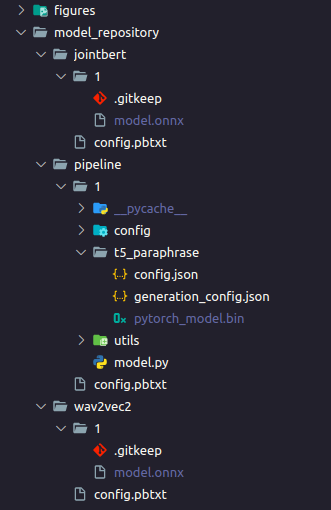

## Triton-Pipeline

### Installing
- Create a image that wraps triton image
```
docker build -t triton-pipeline .
```

- Create environment for client
```
virtualenv venv
source venv/bin/activate
pip install -r requirements_client.txt
```

### Prepare model
- Move `jointbert .onnx`, `wav2vec2 .onnx`, `t5 .bin`, `vits2 .onnx` to `model_repository`


### Run Server
- To run server:
```
docker run --gpus=1 -itd --shm-size 4gb -p 8050-8052:8000-8002 -v ${PWD}/model_repository:/models --name triton_pipeline triton-pipeline:latest tritonserver --model-repository=/models
```


### Test Server

- To run client:
```
python3 pipeline_client.py
```

<!-- ```
docker run --gpus=1 -itd -p 8050-8052:8000-8002 -v ${PWD}/model_repository:/models --name triton_test nvcr.io/nvidia/tritonserver:21.10-py3 tritonserver --model-repository=/models
``` -->

<!-- ```
docker run --gpus=1 --rm --net=host -v ${PWD}/model_repository:/models nvcr.io/nvidia/tritonserver:23.08-py3 tritonserver --model-repository=/models

``` -->

<!-- # NOW TEST
```
docker run --gpus=1 -itd --add-host=host.docker.internal:host-gateway -p 8050-8052:8000-8002 -v ${PWD}/model_repository:/models --name triton_test triton_test:latest tritonserver --model-repository=/models
```

```
docker logs -f triton_test
``` -->